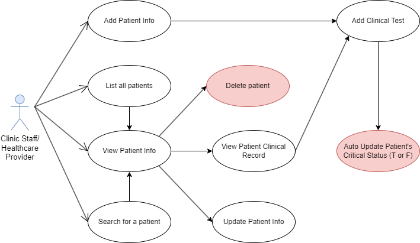

# Patients API Documentation

## Overview

The Patients API is a backend service developed to manage patient data and clinical records for the Patient Management mobile application. Built using Node.js for the backend logic and MongoDB as the database, this API seamlessly integrates with the front-end, which is developed using React Native.

### Technologies

- Backend: Node.js
- Database: MongoDB
- Front-end: React Native

### Target Audience

This documentation is intended for developers involved in building or maintaining the Patient Management mobile application.

### Project Repositories

- [Node.js API](https://github.com/adrnmrk/MAPD_712_713_Patient_Management/tree/b2b58b727e2e340c7cebe57720468df652738896/MAPD-713-Group_Project)
- [React Native Patient Management App](https://github.com/adrnmrk/react-patient-project.git)

### Base URL

- **iOS Base URL**: `http://127.0.0.1:3000`
- **Android Base URL**: `http://10.0.2.2:3000`

## Use Case Diagram

## Endpoints

### GET all patients

`GET http://127.0.0.1:3000/patients`

#### **Description**

This endpoint makes an HTTP GET request to retrieve a list of patients.

#### **Response**

Returns a list of all patients. The response will be a JSON array containing patient objects with attributes such as first name, last name, date of birth, contact information, and so on.

#### **Request Example**

    curl --location 'http://127.0.0.1:3000/patients

#### **Response Example**

    [
      {
          "_id": "65f382d7076a0b12026fdb6b",
        "firstName": "Sam",
        "lastName": "Rihan",
        "dateOfBirth": "1999-01-12T00:00:00.000Z",
        "age": 25,
        "gender": "Female",
        ...
      },
      {
         "_id": "76f382d7076a0b12026fxc1f",
        "firstName": "John",
        "lastName": "Doe",
        "dateOfBirth": "1980-01-12T00:00:00.000Z",
        "age": 44,
        "gender": "Male",
        ...
      },
    ]

### Create new patients

`POST http://127.0.0.1:3000/patients`

#### **Description**

This endpoint makes an HTTP POST request that allows you to create a new patient by providing the necessary details.

#### **Response**

Returns a list of all patients. The response will be a JSON array containing patient objects with attributes such as first name, last name, date of birth, contact information, and so on.

#### **Parameters**

| Name                        | In   | Required | Description                                         |
|-----------------------------|--------|----------|---------------------------------------------------|
| firstName                   | body | required | The first name of the patient.                      |
| lastName                    | body | required | The last name of the patient.                       |
| dateOfBirth                 | body | required | The date of birth of the patient.                   |
| age                         | body | required | The age of the patient.                             |
| gender                      | body | required | The gender of the patient.                          |
| height                      | body | required | The height of the patient (cm).                     |
| weight                      | body | required | The weight of the patient (kg).                     |
| address                     | body | required | The address of the patient.                         |
| city                        | body | required | The city of the patient.                            |
| province                    | body | required | The province of the patient.                        |
| postalCode                  | body | required | The postal code of the patient.                     |
| contactNumber               | body | required | The contact number of the patient.                  |
| email                       | body | required | The email address of the patient.                   |
| identification              | body | required | The identification of the patient.                  |
| identificationType          | body | required | The type of identification of the patient.          |
| purposeOfVisit              | body | required | The purpose of the patient's visit.                 |
| primaryCarePhysician        | body | required | The primary care physician of the patient.          |
| physicianContactNumber      | body | required | The contact number of the primary care physician.   |
| listOfAllergies             | body | required | The list of allergies the patient has.              |
| currentMedications          | body | required | The current medications of the patient.             |
| medicalConditions           | body | required | The medical conditions of the patient.              |
| insuranceProvider           | body | required | The insurance provider of the patient.              |
| insuranceIdNumber           | body | required | The insurance ID number of the patient.             |
| insuranceContactNumber      | body | required | The contact number of the insurance provider.       |
| emergencyContactPerson      | body | required | The name of the emergency contact person.           |
| emergencyContactNumber      | body | required | The contact number of the emergency contact person. |

#### **Request Example**

    curl --location 'http://127.0.0.1:3000/patients' \
    --header 'Content-Type: application/json' \
    --data-raw '{
    "firstName": "John",
    "lastName": "Doe",
    "dateOfBirth": "1990-09-09",
    "age": 34,
    "gender": "Male",
    "height": 180,
    "weight": 80,
    "address": "Address for Patient",
    "city": "Toronto",
    "province": "Ontario",
    "postalCode": "M1Q 1V3",
    "contactNumber": "1234567890",
    "email": "123@dfas.ca",
    "identification": "Health card",
    "identificationType": "HealthCard",
    "purposeOfVisit": "Asthma",
    "primaryCarePhysician": "Some Doctor",
    "physicianContactNumber": "1234567890",
    "listOfAllergies": "Bees",
    "currentMedications": "Ibuprofen",
    "medicalConditions": "Diabetes",
    "insuranceProvider": "Sun Life",
    "insuranceIdNumber": "098765432d1",
    "insuranceContactNumber": "0987654321",
    "emergencyContactPerson": "Emely Amby",
    "emergencyContactNumber": "1111111111"
    }'

#### **Response Example**

    '{
      "firstName": "John",
      "lastName": "Doe",
      "dateOfBirth": "1990-09-09",
      "age": 34,
      "gender": "Male",
      "height": 180,
      "weight": 80,
      "address": "Address for Patient",
      "city": "Toronto",
      "province": "Ontario",
      "postalCode": "M1Q 1V3",
      "contactNumber": "1234567890",
      "email": "123@dfas.ca",
      "identification": "Health card",
      "identificationType": "HealthCard",
      "purposeOfVisit": "Asthma",
      "primaryCarePhysician": "Some Doctor",
      "physicianContactNumber": "1234567890",
      "listOfAllergies": "Bees",
      "currentMedications": "Ibuprofen",
      "medicalConditions": "Diabetes",
      "insuranceProvider": "Sun Life",
      "insuranceIdNumber": "098765432d1",
      "insuranceContactNumber": "0987654321",
      "emergencyContactPerson": "Emely Amby",
      "emergencyContactNumber": "1111111111"
      }'

### GET patient by patientId

`GET http://127.0.0.1:3000/patients/{patientId}`

#### **Description**

This endpoint makes an HTTP GET request to retrieve details of a patient based on the provided patientId.

#### **Response**

The response includes various attributes of the patient such as first name, last name, date of birth, contact information, critical status, and so on.

#### **Parameters**
| Name      | In   | Required | Description | 
| ---       | ---  | ------   |  ---         |
| patientId | path | Yes     | Unique ID to use for this patient |

#### **Request Example**

    curl --location 'http://127.0.0.1:3000/patients/{patientId}'

#### **Response Example**

    [
      {
        "_id": "65f4b15d732c8d4f8e3cd7ab",
        "firstName": "Sarah",
        "lastName": "Johns",
        "dateOfBirth": "1990-09-09T00:00:00.000Z",
        "age": 34,
        "gender": "Female",
        "height": 145,
        "weight": 45,
        "address": "Address for Patient",
        "city": "Toronto",
        "province": "Ontario",
        "postalCode": "M1Q 1V3",
        "contactNumber": "1234567890",
        "email": "123@dfas.ca",
        "identification": "HEalth card",
        "identificationType": "HealthCard",
        "purposeOfVisit": "Asthma",
        "primaryCarePhysician": "Some Doctor",
        "physicianContactNumber": "1234567890",
        "listOfAllergies": "Bees",
        "currentMedications": "Ibuprofen",
        "medicalConditions": "Diabetes",
        "insuranceProvider": "Sun Life",
        "insuranceIdNumber": "098765432d1",
        "insuranceContactNumber": "0987654321",
        "emergencyContactPerson": "Emely Amby",
        "emergencyContactNumber": "1111111111",
        "is_patient_critical": false,
        "createdAt": "2024-03-15T20:36:45.973Z",
        "updatedAt": "2024-03-30T16:22:02.654Z",
        "__v": 0
      }      
    ]

### Update patient details

`PUT http://127.0.0.1:3000/patients/{patientId}`

#### **Description**

This endpoint makes an HTTP PUT request that allows you to update a patient's details.

#### **Response**

The response will be a JSON array containing the updated patient information, including the unique identifier (_id) and timestamps (createdAt, updatedAt). For more information about the parameters, refer to the [Create new patients section](#create-new-patients).

#### **Request Example**

    curl --location --request PUT 'http://127.0.0.1:3000/patients/660984c8fede11c231c93739' \
    --header 'Content-Type: application/json' \
    --data-raw '{
    "firstName": "John",
    "lastName": "Doe",
    "dateOfBirth": "1990-10-10",
    "age": 33,
    "gender": "Male",
    "height": 172,
    "weight": 80,
    "address": "XYZ main street",
    "city": "Toronto",
    "province": "Ontario",
    "postalCode": "M1Q 1V3",
    "contactNumber": "1234567890",
    "email": "123@dfas.ca",
    "identification": "HEalth card",
    "identificationType": "HealthCard",
    "purposeOfVisit": "Asthma",
    "primaryCarePhysician": "Dr. House",
    "physicianContactNumber": "1234567890",
    "listOfAllergies": "Bees",
    "currentMedications": "Ibuprofen",
    "medicalConditions": "Diabetes",
    "insuranceProvider": "Sun Life",
    "insuranceIdNumber": "098765432d1",
    "insuranceContactNumber": "0987654321",
    "emergencyContactPerson": "Emely Amby",
    "emergencyContactNumber": "1111111111"
}'

#### **Response Example**

    '{
      "firstName": "John",
      "lastName": "Doe",
      "dateOfBirth": "1990-09-09",
      "age": 33,
      "gender": "Male",
      "height": 172,
      "weight": 80,
      "address": "XYZ main street",
      "city": "Toronto",
      "province": "Ontario",
      "postalCode": "M1Q 1V3",
      "contactNumber": "1234567890",
      "email": "123@dfas.ca",
      "identification": "Health card",
      "identificationType": "HealthCard",
      "purposeOfVisit": "Asthma",
      "primaryCarePhysician": "Dr. House",
      "physicianContactNumber": "1234567890",
      "listOfAllergies": "Bees",
      "currentMedications": "Ibuprofen",
      "medicalConditions": "Diabetes",
      "insuranceProvider": "Sun Life",
      "insuranceIdNumber": "098765432d1",
      "insuranceContactNumber": "0987654321",
      "emergencyContactPerson": "Emely Amby",
      "emergencyContactNumber": "1111111111"
      }'

### DELETE patient record

`DELETE http://127.0.0.1:3000/patients/{patientId}`

#### **Description**

This endpoint makes an HTTP DELETE request to delete a specific patient record.

#### **Response**

The response includes the ID of the deleted patient record, along with other attributes of the patient such as first name, last name, date of birth, contact information, and so on. It also includes the attribute **updatedAt**, which is the timestamp of when the record was last updated.

#### **Parameters**
| Name      | In   | Required | Description | 
| ---       | ---  | ------   |  ---         |
| patientId | path | Yes     | Unique ID to use for this patient |

#### **Request Example**

    curl --location --request DELETE 'http://127.0.0.1:3000/patients/{patientId}' \
    --header 'Content-Type: application/json' \
    --data-raw '{
        "firstName": "John",
        "lastName": "Doe",
        "dateOfBirth": "2023-09-09",
        "age": 34,
        "gender": "Female",
        "height": 145,
        "weight": 45,
        "address": "Address for PAtient",
        "city": "Toronto",
        "province": "Ontario",
        "postalCode": "M1Q 1V3",
        "contactNumber": "1234567890",
        "email": "123@dfas.ca",
        "identification": "HEalth card",
        "identificationType": "HealthCard",
        "purposeOfVisit": "Asthma",
        "primaryCarePhysician": "Some Doctor",
        "physicianContactNumber": "1234567890",
        "listOfAllergies": "Bees",
        "currentMedications": "Ibuprofen",
        "medicalConditions": "Diabetes",
        "insuranceProvider": "Sun Life",
        "insuranceIdNumber": "098765432d1",
        "insuranceContactNumber": "0987654321",
        "emergencyContactPerson": "Emely Amby",
        "emergencyContactNumber": "1111111111"
        }'

#### **Response Example**

    {
      "_id": "6609cf25fede11c231c93741",
      "firstName": "Jane",
      "lastName": "Doer",
      "dateOfBirth": "2023-09-09T00:00:00.000Z",
      "age": 34,
      "gender": "Female",
      "height": 145,
      "weight": 45,
      "address": "Address for PAtient",
      "city": "Toronto",
      "province": "Ontario",
      "postalCode": "M1Q 1V3",
     "contactNumber": "1234567890",
      "email": "123@dfas.ca",
      "identification": "HEalth card",
      "identificationType": "HealthCard",
      "purposeOfVisit": "Asthma",
      "primaryCarePhysician": "Some Doctor",
      "physicianContactNumber": "1234567890",
      "listOfAllergies": "Bees",
      "currentMedications": "Ibuprofen",
      "medicalConditions": "Diabetes",
      "insuranceProvider": "Sun Life",
      "insuranceIdNumber": "098765432d1",
      "insuranceContactNumber": "0987654321",
      "emergencyContactPerson": "Emely Amby",
      "emergencyContactNumber": "1111111111",
      "createdAt": "2024-03-31T21:01:25.853Z",
      "updatedAt": "2024-03-31T21:01:25.853Z",
      "__v": 0
      }

### GET clinical data by patientId

`GET http://127.0.0.1:3000/patients/{patientId}/clinicaldata`

#### **Description**

This endpoint makes an HTTP GET request to retrieve clinical data of a patient based on the provided patientId.

#### **Response**

The response is a JSON array and includes clinical data such as such as systolic and diastolic blood pressure, respiratory rate, blood oxygen level, pulse rate, patient ID, critical condition status.

#### **Parameters**

| Name      | In   | Required | Description | 
| ---       | ---  | ------   |  ---         |
| patientId | path | Yes     | Unique ID to use for this patient |

#### **Request Example**

    curl --location 'http://127.0.0.1:3000/patients/{patientId}/clinicaldata'

#### **Response Example**

    [
      {
        "_id": "66086a77cfee14a94eddfb86",
        "bp_systolic": 120,
        "bp_diastolic": 90,
        "respiratory_rate": 20,
        "blood_oxygen_level": 95,
        "pulse_rate": 60,
        "patientId": "65f4b15d732c8d4f8e3cd7ab",
        "is_critical_condition": false,
        "createdAt": "2024-03-30T19:39:35.930Z",
        "updatedAt": "2024-03-30T19:39:35.930Z",
        "__v": 0
      }      
    ]

### Create new clinical data for a patient

`POST http://127.0.0.1:3000/patients/{patientId}/clinicaldata`

#### **Description**

This endpoint makes an HTTP POST request to add clinical data of a patient based on the provided patientId.

#### **Response**

The response is a JSON array and includes clinical data such as such as systolic and diastolic blood pressure, respiratory rate, blood oxygen level, pulse rate, patient ID, critical condition status.

#### **Parameters**

| Name      | In   | Required | Description | 
| ---       | ---  | ------   |  ---         |
| patientId | path | Yes     | Unique ID to use for this patient |
| bp_systolic       | body  | Yes      | The systolic blood pressure of the patient.|
| bp_diastolic      | body  | Yes      | The diastolic blood pressure of the patient.|
| respiratory_rate  | body  | Yes      | The respiratory rate of the patient.      |
| blood_oxygen_level| body  | Yes      | The blood oxygen level of the patient.    |
| pulse_rate        | body  | Yes      | The pulse rate of the patient.            |

#### **Request Example**

    curl --location 'http://127.0.0.1:3000/patients/660984c8fede11c231c93739/clinicaldata' \
      --header 'Content-Type: application/json' \
      --data
        '{
          "bp_systolic": 120,
          "bp_diastolic": 90,
          "respiratory_rate": 20,
          "blood_oxygen_level": 96,
          "pulse_rate": 85
        }'

#### **Response Example**

    {
        "_id": "6609d3cffede11c231c9374a",
        "bp_systolic": 120,
        "bp_diastolic": 90,
        "respiratory_rate": 20,
        "blood_oxygen_level": 96,
        "pulse_rate": 85,
        "patientId": "660984c8fede11c231c93739",
        "is_critical_condition": false,
        "createdAt": "2024-03-31T21:21:19.508Z",
        "updatedAt": "2024-03-31T21:21:19.508Z",
        "__v": 0
    }

##### NOTE: The *is_critical_condition* attribute is a boolean that automatically updates based on the latest clinical data. If any of the patient's vital signs is outside the normal range, *is_critical_condition* is set to **TRUE**.

### GET all critical patients

`GET http://127.0.0.1:3000/patients`

#### **Description**

This endpoint makes an HTTP GET request to retrieve a list of patients in critical condition.

The *is_critical_condition* attribute is a boolean that automatically updates based on the latest clinical data. If any of the patient's vital sign is outside the normal range, *is_critical_condition* is set to **TRUE**. If a patient's *is_critical_condition* is TRUE, their record is included in the response.

#### **Response**

Returns a list of all patients. The response will be a JSON array containing patient objects with attributes such as first name, last name, date of birth, contact information, and so on.

#### **Request Example**

`curl --location 'http://127.0.0.1:3000/patients/critical'`

#### **Response Example**

    [
    {
        "_id": "660758f602f8073d1a9f3e54",
        "firstName": "Sam",
        "lastName": "Smith",
        "dateOfBirth": "1993-08-01T04:00:00.000Z",
        "age": 30,
        "gender": "Male",
        "height": 189,
        "weight": 89,
        "address": null,
        "city": null,
        "province": "ON",
        "postalCode": "L5b 2Z1",
        "contactNumber": "8923455",
        ...
        "is_patient_critical": true
    },
    {
        "_id": "65f4ca0a732c8d4f8e3cd7fa",
        "firstName": "a",
        "lastName": "a",
        "dateOfBirth": "2000-01-01T00:00:00.000Z",
        "age": 24,
        "gender": "Male",
        "height": 170,
        "weight": 80,
        "address": null,
        "city": null,
        "province": "ON",
        "postalCode": "m1m1m1",
        "contactNumber": "555",
        ...
        "is_patient_critical": true,
        "createdAt": "2024-03-15T22:22:02.465Z",
        "updatedAt": "2024-03-15T22:22:13.180Z",
        "__v": 0
    }
]